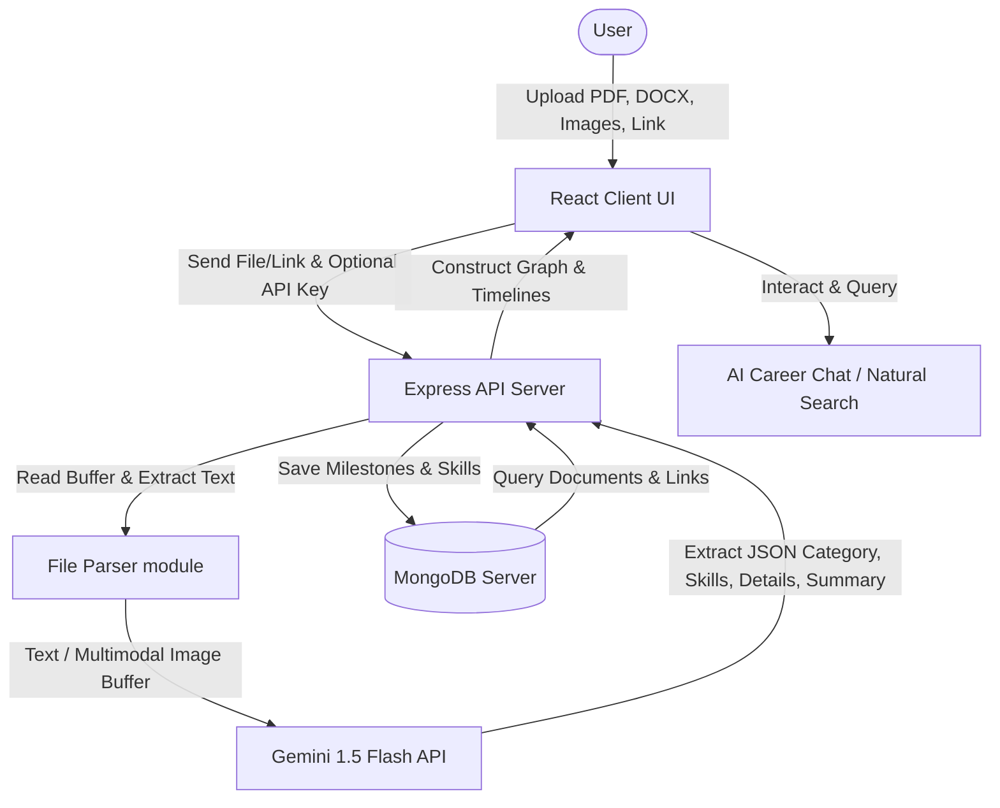

# MemoryVerse AI '26

MemoryVerse AI '26 is an intelligent personal digital identity companion that remembers, organizes, and connects a student's entire digital journey. It ingests scattered academic and professional documents (resumes, certificates, internship letters, project reports, and URLs) and transforms them into a structured, searchable, and connected knowledge graph.

## Core Features

- **Module 1: AI Data Ingestion**: Drag-and-drop file ingestion support for PDF, DOCX, TXT, and Images (JPEG/PNG). Standard link submission for portfolios, GitHub repositories, and academic records.
- **Module 2: Intelligent Categorization**: Automatic classification of milestones into meaningful categories (`Projects`, `Skills`, `Certifications`, `Internships`, `Achievements`, `Academics`).
- **Module 3: Relationship Engine**: Establishes connections between certifications, projects, skills, and internships, displaying them in a real-time, interactive **Knowledge Graph** built with custom HTML5 Canvas physics.
- **Module 4: Digital Journey Timeline**: Generates an interactive vertical timeline of milestones grouped by year (2023–2026+), highlighting the user's progress.
- **Module 5: Smart Retrieval System**:
  - **Natural Search**: Translates conversational search queries ("Show my Python projects") into database filters.
  - **AI Career Companion**: A context-grounded chat assistant powered by Gemini that answers career questions using your actual milestones.

---

## Tech Stack & System Architecture

### Frontend (Client)
- **Framework**: React.js (built with Vite)
- **Styling**: Vanilla CSS (Cybernetic Dark Space / Neon Violet Theme, glassmorphism card layouts, fluid custom scrollbars, and timeline glowing animations)
- **Visual Network**: Force-directed interactive canvas physics engine (repulsion, attraction, gravity, node panning/zoom/drag)

### Backend (Server)
- **Server**: Node.js + Express.js API
- **Database**: MongoDB (Local Instance)
- **AI Integrations**: Gemini 1.5 Flash (using the `@google/generative-ai` SDK)
- **File Processing**: `pdf-parse` (PDF extraction) and `mammoth` (Word extraction)



---

## Database Models (MongoDB)

### 1. `Document`
Stores the metadata and text content extracted from milestones.
```json
{
  "title": "String",
  "filename": "String",
  "filepath": "String",
  "mimeType": "String",
  "category": "Projects | Skills | Certifications | Internships | Achievements | Academics | Other",
  "skills": ["String"],
  "organization": "String",
  "date": "Date",
  "description": "String",
  "summary": "String",
  "rawText": "String",
  "sourceUrl": "String"
}
```

### 2. `Skill`
Maintains unique competency tags and maps back to source documents.
```json
{
  "name": "String (Unique)",
  "category": "String",
  "documents": ["ObjectId (Ref: Document)"]
}
```

### 3. `Relationship`
Stores custom user-defined or AI-suggested linkages.
```json
{
  "sourceId": "ObjectId (Ref: Document)",
  "targetId": "ObjectId (Ref: Document)",
  "type": "completed_during | prerequisite_for | applied_in | associated_with"
}
```

---

## Setup & Running Guide

### Prerequisites
- **Node.js**: v22.x or later installed.
- **MongoDB**: A local instance running on `mongodb://localhost:27017` (Ensure the MongoDB service is active).
- **Gemini API Key**: Obtain a key from Google AI Studio.

### Steps to Run

1. **Clone & Setup Environment**
   If you want to define your Gemini API key in the server backend, create a `.env` file in the `server/` directory:
   ```env
   PORT=5000
   MONGO_URI=mongodb://localhost:27017/memoryverse
   GEMINI_API_KEY=your_gemini_api_key_here
   ```
   *Note: If you do not set `GEMINI_API_KEY` in the backend environment, you can enter it directly in the Settings panel of the Frontend UI, which saves it locally to your browser.*

2. **Install Dependencies**
   Run the setup script from the root directory:
   ```bash
   npm run setup
   ```
   This will install all required packages for the root, backend server, and frontend client.

3. **Start Development Servers**
   Run the dev script in the root directory:
   ```bash
   npm run dev
   ```
   This starts both the Express server on port 5000 and the Vite frontend server on port 5173 concurrently.

4. **Access the Application**
   Open your browser and navigate to:
   ```
   http://localhost:5173
   ```
